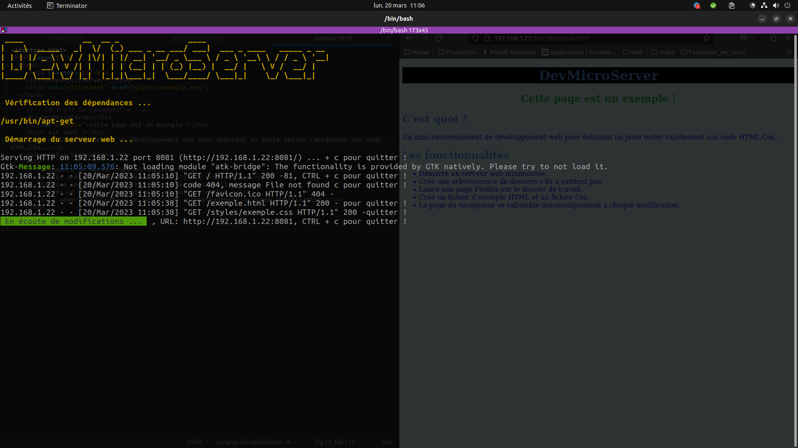
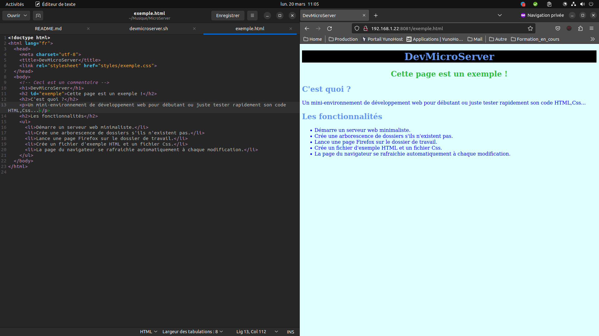

# Devmicroserver
Un mini-environnement de développement web pour débutant ou juste tester rapidement son code HTML,Css...
                                                   
## Fonctionnalitées:
* Démarre un serveur web minimaliste.
* Crée une arborescence de dossiers s'ils n'existent pas.
* Lance une page firefox sur le dossier de travail.
* Crée un fichier d'exemple HTML et un fichier Css.
* La page du navigateur se rafraichie automatiquement à chaque modification.
                                                                                           
## Usage
```bash
./devmicroserver.sh
```

## Limits:
*  Fonctionne seulement sur les distribution dérivées de Debian.
*  Fonctionne seulement avec le navigateur Firefox.
*  A besoin des paquets: python3, xdotool et firefox.
*  Utilise le port 8081.                                             
                                                                                            
## Captures d'écran

### Lancement du script


### Page du navigateur

